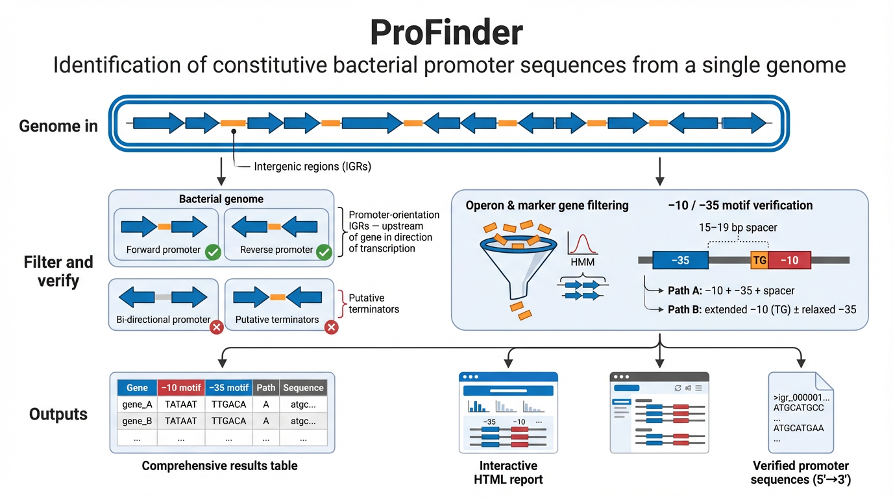

# ProFinder



ProFinder extracts high-confidence constitutive promoter candidates from bacterial or archaeal genome assemblies. Given a FASTA file, it returns a curated shortlist of promoter sequences upstream of conserved housekeeping genes, ready for use in expression constructs, reporter systems, or metabolic engineering.

## How the pipeline works

ProFinder applies a series of biologically motivated filters to identify promoter sequences upstream of single-copy phylogenetic marker genes that are conserved in diverse bacteria: ribosomal proteins, tRNA synthetases, DNA replication components, and similar housekeeping functions.

The pipeline annotates a genome with [Prokka](https://github.com/tseemann/prokka), extracts intergenic regions between annotated CDS features, identifies operons using a two-pass proximity/flanking-distance algorithm, and screens for marker genes via hmmsearch against 98 curated HMM profiles. Candidate promoters are then verified by scanning for −10 and −35 hexamer motifs separated by a 15–19 bp spacer. A final HTML report and comprehensive results table are generated.

## Requirements

ProFinder needs Python ≥ 3.9, [Prokka](https://github.com/tseemann/prokka), and [HMMER](http://hmmer.org/) (specifically `hmmsearch`). HMM profiles and motif databases are bundled with the package.

Python dependencies: `pandas ≥ 1.3`, `biopython ≥ 1.79`.

## Installation

**1. Create the environment and install bioinformatics tools**

```bash
conda create -n profinder -c bioconda -c conda-forge \
    python=3.12 prokka hmmer pip -y
conda activate profinder
```

**2. Clone and install ProFinder**

```bash
git clone https://github.com/jmarsh/profinder.git
cd profinder
pip install .
```

This pulls in the Python dependencies via pip and registers the `profinder` command. All bundled data (HMM profiles, motif files) is installed as package data alongside the Python modules.

For development (editable install):

```bash
pip install -e .
```

**3. Verify the installation**

```bash
profinder --list          # prints the 13 pipeline steps
prokka --version          # should print version ≥ 1.14
hmmsearch -h | head -1    # should print HMMER version
```

**Alternative: separate conda environments**

If bioconda's Prokka conflicts with other packages, install each tool in its own environment and point ProFinder at them:

```bash
conda create -n prokka_env -c bioconda -c conda-forge prokka -y
conda create -n hmmer_env  -c bioconda -c conda-forge hmmer -y

conda create -n profinder -c conda-forge python=3.12 pip -y
conda activate profinder
pip install .

profinder -i genome.fasta -o results/ \
    --conda-prokka prokka_env \
    --conda-hmm hmmer_env
```

## Quick start

Bacterial genome (default):

```bash
profinder -i my_genome.fasta -o results/
```

Archaeal genome:

```bash
profinder -i my_genome.fasta -o results/ --domain archaea
```

Append the first 90 nt of each downstream CDS to promoter sequences:

```bash
profinder -i my_genome.fasta -o results/ --cds-bp 90
```

Batch mode (multiple genomes from a TSV table):

```bash
profinder --batch samples.tsv -o results/
```

The pipeline checkpoints at each step. Re-running the same command skips completed steps. Use `--force` to re-run everything.

## Pipeline steps

| Step | Description | Key output |
|------|-------------|------------|
| 1 | Run Prokka | `prokka/genome.gff`, `prokka/genome.faa` |
| 2 | Extract intergenic regions | `igr/igr_summary.tsv`, `igr/intergenic_regions.fasta` |
| 3 | Identify operons | `operons.tsv` |
| 4 | Run hmmsearch | `hmm/tblout/*.tblout` |
| 5 | Filter HMM output | `hmm/hmm_filtered.tsv` |
| 6 | Filter operons + add markers | `operons_filtered_markers.tsv` |
| 7 | Match IGRs to marker operons | `promoter_markers.tsv`, `promoter_markers_hmm.tsv` |
| 8 | Extract marker promoters | `promoters.fasta` |
| 9 | Extract all promoter-orientation IGRs | `all_promoters.fasta` |
| 10 | Scan promoter motifs (−10/−35) | `motif_best_all.tsv`, `motif_best_markers.tsv`, `promoter_markers_verified.tsv` |
| 11 | Annotate CDS (Prokka) | `cds_annotations.tsv` |
| 12 | Build final output table | `profinder_results.tsv` |
| 13 | Generate HTML report | `promoter_report.html` |

Step 10 scans two sets independently. First, all promoter-orientation IGRs (from step 9) are screened for −10/−35 motif combinations, producing a genome-wide catalogue of motif-confirmed promoters regardless of HMM marker status. Second, the marker-filtered subset (from step 8) is scanned separately, producing verified marker promoters with motif details merged onto the original metadata.

## IGR orientation logic

Each intergenic region is classified by the strand orientation of its flanking genes:

**CO_F** (co-oriented forward): both genes on the + strand. The IGR lies upstream of the right (downstream) gene in the direction of transcription. Sequence is already 5'→3'.

**CO_R** (co-oriented reverse): both genes on the − strand. The IGR lies upstream of the left (downstream) gene, which runs right to left. Sequence is reverse-complemented to 5'→3'.

**DP** (divergent promoter): genes point away from each other (← IGR →). Contains promoters for both flanking genes, but the promoter–gene assignment is ambiguous without experimental data. Excluded from downstream analysis.

**CONV** (convergent): genes point toward each other (→ IGR ←). Sits between two convergent stop codons and does not contain a promoter for either flanking gene. Excluded.

Only CO_F and CO_R IGRs proceed past step 2. These are referred to as "promoter-orientation" IGRs throughout the pipeline and documentation.

## Motif-based promoter verification

Step 10 verifies candidate promoters by scanning for the −10 and −35 hexamer elements using position weight matrices (PWMs) from three MEME-format databases:

**CollecTF** — experimentally validated transcription factor binding sites.
**PRODORIC** — prokaryotic gene regulation motifs.
**RegTransBase** — regulatory interaction motifs.

Each frequency matrix is converted to a log₂-odds scoring matrix assuming a uniform background (0.25 per base). A score threshold for each motif is computed by exhaustive enumeration of all 4⁶ = 4,096 possible hexamers at the desired p-value. A hit passes if its score exceeds the threshold for any loaded motif from any database.

Two recognition paths are evaluated:

**Path A (canonical):** A −10 hit and a −35 hit are both present with a spacer of 15–19 bp between the start of the −35 hexamer and the start of the −10 hexamer.

**Path B (extended −10):** A −10 hit is preceded by a TG dinucleotide at positions −2/−1 relative to the −10 start. In this case the −35 element is required only at a relaxed p-value threshold, or may be absent entirely.

Default p-value thresholds: 0.0025 for −10 hits (`--p10`), 0.0025 for strict −35 hits (`--p35`), 0.05 for relaxed −35 hits when extended −10 is present (`--p35-relaxed`). Both strands of each IGR are scanned.

When multiple hits are found for the same sequence, the best is selected by preferring Path A over Path B with −35 over Path B without −35, then by highest −10 score.

## CDS extension (`--cds-bp`)

By default, FASTA outputs contain promoter sequences only. The `--cds-bp N` option appends the first N nucleotides of the downstream CDS to each promoter sequence, producing additional FASTA files alongside the standard ones. The final results table also gains a `sequence_5p_to_3p_cds` column.

For CO_F promoters the CDS sits on the + strand immediately after the IGR, so the first N bp are read directly from the forward strand. For CO_R promoters the CDS is on the − strand immediately before the IGR, so the first N bp are extracted upstream of the IGR start on the forward strand and reverse-complemented. In both cases the result is the first N coding nucleotides in the 5'→3' reading direction, appended to the 5'→3' promoter sequence.

Set `--cds-bp 0` (the default) to disable this feature.

## Batch mode

The `--batch` flag accepts a tab-separated table with the following columns:

| Column | Required | Description |
|--------|----------|-------------|
| `sample_id` | yes | Unique identifier for each sample |
| `fasta` | yes | Path to genome FASTA |
| `gff` | no | Path to existing GFF3 (skips Prokka if provided with `faa`) |
| `faa` | no | Path to existing protein FASTA |
| `fna` | no | Path to existing nucleotide FASTA |

Each sample is processed independently in its own subdirectory under the output directory. When `gff` and `faa` are provided, Prokka (step 1) is skipped and the supplied files are symlinked into place.

## CLI reference

```
profinder -i FASTA -o DIR [options]
profinder --batch TABLE -o DIR [options]

Input (mutually exclusive):
  -i, --input              Input genome FASTA (single-sample mode)
  --batch                  TSV table for batch mode

Output:
  -o, --output             Output directory (default: output/)

Domain:
  --domain {bacteria,archaea}
                           Target domain; affects Prokka --kingdom
                           (default: bacteria)

Step control:
  --start N                First step to run (default: 1)
  --end N                  Last step to run (default: 13)
  --list                   List steps and exit
  --force                  Re-run all steps, ignoring checkpoints

Tool paths:
  --prokka PATH            Prokka binary (default: prokka)
  --hmmsearch PATH         hmmsearch binary (default: hmmsearch)
  --hmm-dir DIR            Directory of individual .hmm profile files
                           (default: bundled profinder/hmms/)

Motif scanning:
  --motifs-dir DIR         Directory of .meme motif files
                           (default: bundled profinder/motifs/)
  --p10 F                  p-value threshold for −10 hits (default: 0.0025)
  --p35 F                  p-value threshold for −35 hits (default: 0.0025)
  --p35-relaxed F          Relaxed −35 threshold when extended −10 TG
                           is present (default: 0.05)

Conda environments:
  --conda-prokka ENV       Conda env for Prokka
  --conda-hmm ENV          Conda env for hmmsearch

Parameters:
  --threads N              Threads for external tools (default: 4)
  --kingdom STR            Prokka kingdom (default: Bacteria; auto-set
                           to Archaea when --domain archaea)
  --prefix STR             Prokka output prefix (default: genome)
  --igr-min N              Minimum IGR length in bp (default: 81)
  --igr-max N              Maximum IGR length in bp (default: 1000)
  --max-internal-dist N    Max gap within an operon in bp (default: 25)
  --min-flanking-dist N    Min gap at operon boundaries in bp (default: 75)
  --hmm-bitscore F         Minimum HMM bitscore (default: 25.0)
  --cds-bp N               Append first N nt of downstream CDS to
                           promoter sequences (default: 0, disabled)
```

## Output structure

```
output/
├── prokka/                              # Prokka annotation files
├── igr/                                 # Intergenic region extraction
│   ├── igr_summary.tsv
│   └── intergenic_regions.fasta
├── operons.tsv                          # Operon identification
├── hmm/                                 # HMM marker screening
│   ├── tblout/                          # Per-profile hmmsearch output
│   ├── hmm_combined.tsv
│   └── hmm_filtered.tsv
├── operons_filtered_markers.tsv         # Filtered operons with marker info
├── promoter_markers.tsv                 # Marker promoters (one row per IGR)
├── promoter_markers_hmm.tsv             # Marker promoters × HMM profiles
├── promoters.fasta                      # Marker-filtered promoters (5'→3')
├── all_promoters.fasta                  # All promoter-orientation IGRs (5'→3')
├── motif_hits_all.tsv                   # All motif hits, all IGRs
├── motif_best_all.tsv                   # Best motif hit per IGR (all)
├── motif_hits_markers.tsv               # All motif hits, marker IGRs
├── motif_best_markers.tsv               # Best motif hit per IGR (markers)
├── all_promoters_verified.fasta         # Motif-confirmed promoters (all)
├── promoter_markers_verified.tsv        # Motif-confirmed marker promoters
├── marker_promoters_verified.fasta      # Motif-confirmed promoters (markers)
├── cds_annotations.tsv                  # CDS product names from Prokka
├── profinder_results.tsv                # Comprehensive results table
└── promoter_report.html                 # Visual HTML report
```

When `--cds-bp` is set above 0, additional FASTA files with `_cds_bp` suffixes are produced for both marker-filtered and all-promoter sets.

The `profinder_results.tsv` table contains one row per promoter-orientation IGR with columns for contig coordinates, associated CDS annotation (gene name, locus tag, product), marker status, motif verification result, motif details (−10/−35 positions, sequences, scores, sources, spacer length, recognition path), and the full 5'→3' sequence.

The `promoter_markers_hmm.tsv` table expands the marker promoters so that each IGR × HMM profile combination gets its own row, allowing users to see all HMM associations for every marker promoter.

## Bundled data

```
profinder/
├── hmms/                      # 838 individual HMM profiles
│   ├── 5-FTHF_cyc-lig.hmm
│   ├── ATP-synt.hmm
│   └── ...
└── motifs/                    # MEME-format PWM databases
    ├── collectf.meme
    ├── prodoric_2021.9.meme
    └── regtransbase.meme
```

## License

MIT
