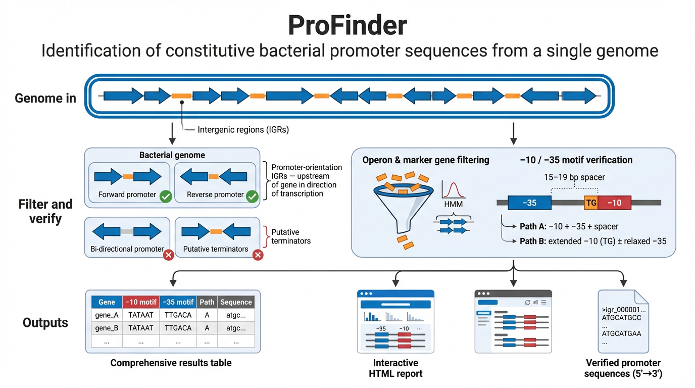

# ProFinder



ProFinder extracts high-confidence constitutive promoter candidates from a single bacterial or archaeal genome assembly. Given a FASTA file, it returns a curated shortlist of promoter sequences upstream of conserved single-copy housekeeping genes, oriented 5'→3' and ready for use in expression constructs, reporter systems, or metabolic engineering.


## Access the server

[ProFinder Web Interface](https://plabase.cs.uni-tuebingen.de/profinder/)


## How the pipeline works

ProFinder applies a series of biologically motivated filters to find promoters upstream of single-copy phylogenetic marker genes that are conserved across diverse bacteria and archaea: ribosomal proteins, tRNA synthetases, RNA polymerase subunits, DNA replication and repair components, translation factors, and similar housekeeping functions. Because these genes are constitutively and highly expressed, their promoters are strong constitutive-promoter candidates.

The pipeline annotates a genome with [Prokka](https://github.com/tseemann/prokka) (run with `--rfam`, so non-coding RNA features bound intergenic regions), extracts intergenic regions (IGRs) between annotated features, identifies operons with a two-pass proximity / flanking-distance algorithm, and screens for marker genes via `hmmsearch` against 98 bundled HMM profiles. Candidate promoters are then verified by scanning for −10 and −35 hexamer motifs with a 16–18 bp spacer, using position weight matrices calibrated against the composition of the genome being scanned. A final results table and an HTML report are produced.

ProFinder reports two promoter sets from every run: a genome-wide catalogue of every motif-confirmed promoter-orientation IGR, and the marker-gene-constrained subset. The marker subset is the headline deliverable.


## Requirements

ProFinder needs Python ≥ 3.9, [Prokka](https://github.com/tseemann/prokka), and [HMMER](http://hmmer.org/) (specifically `hmmsearch`). The −10/−35 scan reads MEME-format motif files directly in Python, so the MEME suite is **not** required. HMM profiles and the motif file are bundled with the package.

Python dependencies: `pandas ≥ 1.3`, `biopython ≥ 1.79`. `matplotlib` is optional and only used to render the figure in the p-value-sweep diagnostic.


## Installation

**1. Create the environment and install the external tools**

```bash
conda create -n profinder -c bioconda -c conda-forge \
    python=3.12 prokka hmmer pip -y
conda activate profinder
```

**2. Clone and install ProFinder**

```bash
git clone https://github.com/jmarsh/profinder.git
cd profinder
pip install .
```

This pulls in the Python dependencies via pip and registers the `profinder` command. All bundled data (HMM profiles, motif file) is installed as package data alongside the Python modules.

For development (editable install):

```bash
pip install -e .
```

Optional diagnostic figure support:

```bash
pip install ".[diagnostics]"     # adds matplotlib for --diagnose-p-sweep
```

**3. Verify the installation**

```bash
profinder --list          # prints the 11 pipeline steps
prokka --version          # should print version ≥ 1.14
hmmsearch -h | head -1     # should print the HMMER version
```

**Alternative: separate conda environments**

If bioconda's Prokka conflicts with other packages, install each tool in its own environment and point ProFinder at them:

```bash
conda create -n prokka_env -c bioconda -c conda-forge prokka -y
conda create -n hmmer_env  -c bioconda -c conda-forge hmmer -y

conda create -n profinder -c conda-forge python=3.12 pip -y
conda activate profinder
pip install .

profinder -i genome.fasta -o results/ \
    --conda-prokka prokka_env \
    --conda-hmm hmmer_env
```


## Quick start

Bacterial genome (default):

```bash
profinder -i my_genome.fasta -o results/
```

Archaeal genome (sets Prokka `--kingdom Archaea`):

```bash
profinder -i my_genome.fasta -o results/ --domain archaea
```

Append the first 90 nt of each downstream CDS to the final-table sequence:

```bash
profinder -i my_genome.fasta -o results/ --cds-bp 90
```

Batch mode (multiple genomes from a TSV table):

```bash
profinder --batch samples.tsv -o results/
```

The pipeline checkpoints at each step. Re-running the same command skips completed steps. Use `--force` to re-run everything.


## Pipeline steps

`profinder --list` prints the 11 steps below. Intermediates are written into per-stage subdirectories (`igr/`, `hmm/`, `operons/`, `motifs/`); only the final deliverables sit at the top level of the output directory.

| Step | Description | Key output |
|------|-------------|------------|
| 1 | Run Prokka (`--rfam`) | `prokka/genome.gff`, `prokka/genome.faa` |
| 2 | Extract intergenic regions | `igr/igr_summary.tsv`, `igr/intergenic_regions.fasta` |
| 3 | Identify operons | `operons/operons.tsv` |
| 4 | Run hmmsearch (98 profiles) | `hmm/tblout/*.tblout` |
| 5 | Filter HMM output | `hmm/hmm_filtered.tsv` |
| 6 | Filter operons + add markers | `operons/operons_filtered_markers.tsv` |
| 7 | Match IGRs to marker operons | `operons/promoter_markers.tsv`, `operons/promoter_markers_hmm.tsv` |
| 8 | Scan promoter motifs (−10/−35, paths A–D) | `motifs/motif_best_all.tsv`, `motifs/promoter_markers_verified.tsv`, `all_promoters_verified.fasta`, `marker_promoters_verified.fasta` |
| 9 | Annotate CDS (Prokka) | `cds_annotations.tsv` |
| 10 | Build final output table | `profinder_results.tsv` |
| 11 | Generate HTML report | `promoter_report.html` |

Step 8 scans two sets independently against the same calibrated motifs. First, all promoter-orientation IGRs (CO_F / CO_R) are screened for −10/−35 combinations, producing a genome-wide catalogue of motif-confirmed promoters regardless of marker status. Second, the marker-filtered subset (from step 7) is scanned, producing verified marker promoters with motif details merged onto the original metadata.


## IGR orientation logic

Each intergenic region is classified by the strand orientation of its flanking genes, following PIGGY's labels:

**CO_F** (co-oriented forward): both genes on the + strand. The IGR lies upstream of the right (downstream) gene in the direction of transcription. The sequence is already 5'→3'.

**CO_R** (co-oriented reverse): both genes on the − strand. The IGR lies upstream of the left (downstream) gene, which runs right to left. The sequence is reverse-complemented to 5'→3'.

**DP** (divergent promoter): genes point away from each other (← IGR →). Contains promoters for both flanking genes, but the promoter–gene assignment is ambiguous without experimental data.

**CONV** (convergent): genes point toward each other (→ IGR ←). Sits between two stop codons and does not carry a promoter for either flanking gene.

CO_F and CO_R are the **promoter-orientation** IGRs carried into the motif scan and the final table; DP and CONV are excluded from those outputs. Boundary features used to define IGRs include CDS and all Prokka `--rfam` non-coding RNA classes (tRNA, rRNA, tmRNA, ncRNA, misc_RNA), and any window overlapping an annotated feature is rejected, so IGRs never sit inside or across a non-coding gene. An IGR is kept only when its downstream (promoter-target) gene is a CDS, rRNA, or tRNA — the classes that carry strong constitutive promoters (rRNA and tRNA operons include the rrn P1/P2 promoters). An IGR that would only drive a tmRNA, ncRNA, or misc_RNA is dropped, while those features still serve as boundaries for neighbouring IGRs. Only IGRs of length 81–1000 bp (configurable) are kept.


## Motif-based promoter verification

Step 8 verifies candidate promoters by scanning for the −10 and −35 hexamer elements using position weight matrices (PWMs) from the bundled `all_unique_subgroups.meme` file. That file holds 72 paired subgroups (`M001_m10` / `M001_m35` … `M072`), where the prefix identifies the subgroup and the `_m10` / `_m35` suffix the element type.

**Per-genome background.** Each frequency matrix is converted to a log₂-odds PWM scored against the A/C/G/T composition of the input genome (computed from the Prokka `.fna`, or the input FASTA), not a fixed uniform background. Significance therefore reflects the genome being scanned. The uniform background written in the MEME header is present only for compatibility with other MEME-format tools.

**Exact thresholds and p-values.** For each PWM, all 4⁶ = 4,096 hexamer scores are enumerated and weighted by their probability under the genome background. This gives an exact score threshold for any target p-value and an exact empirical p-value for every hit, comparable across subgroups of differing information content.

**Low-complexity masking.** Before scoring, a Shannon-entropy mask (12 bp window, < 1.4 bits) blanks anchor positions inside homopolymers, simple repeats, and strongly biased tracts, so the AT-rich −10 PWM does not pile up spurious hits in poly-A runs.

**Orientation-aware scanning.** CO_F / CO_R IGRs are scanned on the + strand of the already-oriented sequence only, because a − strand motif would describe a promoter pointing away from the downstream marker gene. DP IGRs would be scanned on both strands.

**Distance-to-CDS cutoff.** A −10 hit whose right edge sits more than `--max-dist-to-cds-start` bp (default 200) from the downstream CDS start is dropped before the spacer search. This captures the bulk of literature σ⁷⁰ leader lengths while removing distal motifs in long IGRs that are unlikely to drive the downstream gene.

**Recognition paths.** Each surviving −10 hit is classified into one of four paths, in priority order. Paths A–C require a −35 hit with a 16–18 bp spacer (canonical σ⁷⁰ spacer is 17 ± 1 bp); path D requires only an extended −10:

**Path A** — a strict −35 from the *same* subgroup as the −10 (linked pair).
**Path B** — an extended −10 (a TG dinucleotide immediately upstream, accepted at either the −2/−1 or −3/−2 position of the −10 hexamer) plus a *relaxed* −35 from the same subgroup.
**Path C** — a strict −35 from a *different* subgroup (unlinked).
**Path D** — an extended −10 with no −35 in the 16–18 bp window.

Default p-value thresholds: `--p10` 0.01 for −10 hits, `--p35` 0.01 for strict −35 hits (paths A and C), `--p35-relaxed` 0.20 for the relaxed −35 used only in path B. These are the manuscript-selected operating point, fixed by a 39-point sweep on the two benchmark organisms.

When several subgroups exceed threshold at one position, the most significant (lowest empirical p-value) is reported, with raw log-odds as the tiebreaker. The single best hit per IGR is chosen by path rank (A > B > C > D), then by combined significance −log₁₀(p₁₀) + −log₁₀(p₃₅) (−log₁₀(p₁₀) alone for path D).


## CDS extension (`--cds-bp`)

By default the final table reports the promoter sequence only. `--cds-bp N` appends the first N nucleotides of the downstream CDS, adding a `sequence_5p_to_3p_cds` column to `profinder_results.tsv` (and to the per-sweep tables in diagnostic mode). The FASTA outputs are unaffected.

For CO_F promoters the CDS sits on the + strand immediately after the IGR, so the first N bp are read directly from the forward strand. For CO_R promoters the CDS is on the − strand immediately before the IGR, so the first N bp are extracted upstream of the IGR start and reverse-complemented. In both cases the result is the first N coding nucleotides in the 5'→3' reading direction, appended to the 5'→3' promoter sequence. If N is not a multiple of 3, the run prints an in-frame warning. Set `--cds-bp 0` (the default) to disable.


## Diagnostic mode (`--diagnose-p-sweep`)

Choosing `--p10` and `--p35` is consequential: yield can change by an order of magnitude across reasonable settings. The diagnostic runs the p-value-independent prerequisites (steps 1–7 and step 9), then scans every CO_F / CO_R IGR across a range of thresholds in three modes — `matched` (p10 = p35), `p10_only`, and `p35_only` — and writes:

```
diagnostics/p_sweep.tsv          per-sweep summary counts
diagnostics/p_sweep.png          3-panel figure (requires matplotlib)
diagnostics/sweep_tables/        one profinder_results.tsv per (mode, p10, p35),
                                 pre-filtered to motif_confirmed and path A/B
```

Each per-sweep-point table shares the column layout of the canonical `profinder_results.tsv`, so it can be consumed directly by downstream benchmarking. The sweep range and granularity are set by `--sweep-min`, `--sweep-max`, `--sweep-n`, `--sweep-modes`, and `--sweep-p35-relaxed-ratio`.


## Batch mode

`--batch` accepts a tab-separated table with these columns:

| Column | Required | Description |
|--------|----------|-------------|
| `sample_id` | yes | Unique identifier for each sample |
| `fasta` | yes | Path to genome FASTA |
| `gff` | no | Path to existing GFF3 (skips Prokka if provided with `faa`) |
| `faa` | no | Path to existing protein FASTA |
| `fna` | no | Path to existing nucleotide FASTA |

Each sample is processed independently in its own subdirectory under the output directory. When `gff` and `faa` are provided, Prokka (step 1) is skipped and the supplied files are symlinked into place.


## CLI reference

```
profinder -i FASTA -o DIR [options]
profinder --batch TABLE -o DIR [options]

Input (mutually exclusive):
  -i, --input              Input genome FASTA (single-sample mode)
  --batch                  TSV table for batch mode

Output:
  -o, --output             Output directory (default: output/)

Domain:
  --domain {bacteria,archaea}
                           Target domain; sets Prokka --kingdom
                           (default: bacteria)

Step control:
  --start N                First step to run (default: 1)
  --end N                  Last step to run (default: 11)
  --list                   List steps and exit
  --force                  Re-run all steps, ignoring checkpoints

Tool paths:
  --prokka PATH            Prokka binary (default: prokka)
  --hmmsearch PATH         hmmsearch binary (default: hmmsearch)
  --hmm-dir DIR            Directory of individual .hmm profile files
                           (default: bundled profinder/hmms/)

Motif scanning:
  --meme-file FILE         MEME file with paired M###_m10 / M###_m35
                           subgroup motifs
                           (default: bundled all_unique_subgroups.meme)
  --p10 F                  p-value threshold for −10 hits (default: 0.01)
  --p35 F                  Strict −35 threshold, paths A and C (default: 0.01)
  --p35-relaxed F          Relaxed −35 threshold, path B only (default: 0.20)
  --max-dist-to-cds-start N
                           Max bp from the −10 right edge to the downstream
                           CDS start; farther hits are dropped (default: 200)

Conda environments:
  --conda-prokka ENV       Conda env for Prokka
  --conda-hmm ENV          Conda env for hmmsearch

Parameters:
  --threads N              Threads for external tools (default: 4)
  --kingdom STR            Prokka kingdom (default: Bacteria; auto-set
                           to Archaea when --domain archaea)
  --prefix STR             Prokka output prefix (default: genome)
  --igr-min N              Minimum IGR length in bp (default: 81)
  --igr-max N              Maximum IGR length in bp (default: 1000)
  --max-internal-dist N    Max gap within an operon in bp (default: 25)
  --min-flanking-dist N    Min gap at operon boundaries in bp (default: 75)
  --hmm-bitscore F         Minimum HMM bitscore (default: 25.0)
  --cds-bp N               Append first N nt of downstream CDS to the final
                           table sequence column (default: 0, disabled)

Diagnostic (p-value sweep):
  --diagnose-p-sweep       Run the threshold sweep after step 7 instead of
                           steps 8, 10, 11
  --sweep-min F            Smallest swept p-value (default: 1e-5)
  --sweep-max F            Largest swept p-value (default: 1e-1)
  --sweep-n N              Number of log-spaced sweep points (default: 13)
  --sweep-modes LIST       Comma-separated modes (default:
                           matched,p10_only,p35_only)
  --sweep-p35-relaxed-ratio F
                           p35_relaxed = ratio × p35, capped at 1.0
                           (default: 20.0)
```


## Output structure

```
output/
├── prokka/                              # Prokka annotation files
├── igr/                                 # Intergenic region extraction
│   ├── igr_summary.tsv
│   └── intergenic_regions.fasta
├── hmm/                                 # HMM marker screening
│   ├── tblout/                          # per-profile hmmsearch output
│   ├── hmm_combined.tsv
│   └── hmm_filtered.tsv
├── operons/                             # Operon identification + marker matching
│   ├── operons.tsv
│   ├── operons_filtered.tsv
│   ├── operons_filtered_markers.tsv
│   ├── promoter_markers.tsv             # marker promoters (one row per IGR)
│   └── promoter_markers_hmm.tsv         # marker promoters × HMM profiles
├── motifs/                              # Motif scan
│   ├── motif_hits_all.tsv               # all motif hits, all IGRs
│   ├── motif_best_all.tsv               # best motif hit per IGR (all)
│   ├── motif_hits_markers.tsv           # all motif hits, marker IGRs
│   ├── motif_best_markers.tsv           # best motif hit per IGR (markers)
│   └── promoter_markers_verified.tsv    # motif-confirmed marker promoters
├── all_promoters_verified.fasta         # motif-confirmed promoters, all (5'→3')
├── marker_promoters_verified.fasta      # motif-confirmed marker promoters (5'→3')
├── cds_annotations.tsv                  # CDS product names from Prokka
├── profinder_results.tsv                # comprehensive results table
└── promoter_report.html                 # visual HTML report (top 10 promoters)
```

The HTML report lists the top 10 marker promoters, ranked by motif path (A→B→C→D) then combined −log₁₀(p). Each promoter's sequence diagram is drawn proportional to its actual length and aligned on the 3' (gene-proximal) end, so the −10/−35 elements line up across rows.

In `--diagnose-p-sweep` mode, steps 8, 10, and 11 are replaced by a `diagnostics/` directory (see Diagnostic mode above).

CO_R FASTA records are reverse-complemented so every sequence is oriented 5'→3'. The `profinder_results.tsv` table contains one row per promoter-orientation IGR, with these columns:

```
promoter_id, contig, start, end, length, orientation,
associated_cds, gene_name, locus_tag, product,
is_marker, motif_confirmed, motif_path, motif_strand,
motif_pos_10, motif_seq_10, motif_score_10, motif_pvalue_10, motif_source_10,
motif_has_ext10,
motif_pos_35, motif_seq_35, motif_score_35, motif_pvalue_35, motif_source_35,
motif_spacer_len, motif_spacer_seq,
sequence_5p_to_3p   [, sequence_5p_to_3p_cds when --cds-bp > 0]
```

`promoter_markers_hmm.tsv` expands the marker promoters so each IGR × HMM-profile combination gets its own row, letting you see every HMM association for each marker promoter.


## Bundled data

```
profinder/
├── all_unique_subgroups.meme    # 72 paired M###_m10 / M###_m35 motif subgroups
├── hmms/                         # 98 single-copy marker-gene HMM profiles
│   ├── Ribosomal_L20_8b522e5f.hmm
│   ├── RNA_pol_A_bac_5767a6d9.hmm
│   ├── TIGR00472_1cfca671.hmm
│   └── ...
└── motifs/
    └── all_unique_subgroups.meme  # copy of the motif file
```

The HMM set spans ribosomal proteins, tRNA synthetases, RNA polymerase subunits, DNA replication and repair, cell division, and translation factors — single-copy genes conserved across the bacterial and archaeal tree. By default ProFinder reads the motif file from the package root; `profinder/motifs/` holds an identical copy.


## License

MIT
